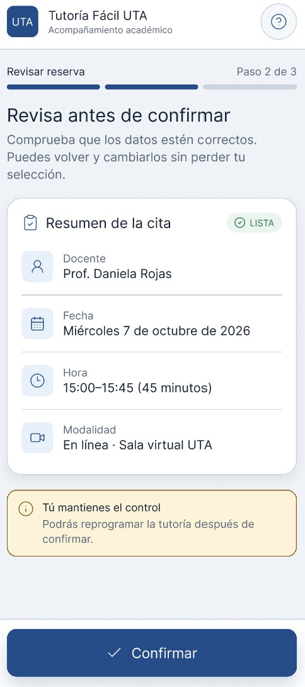
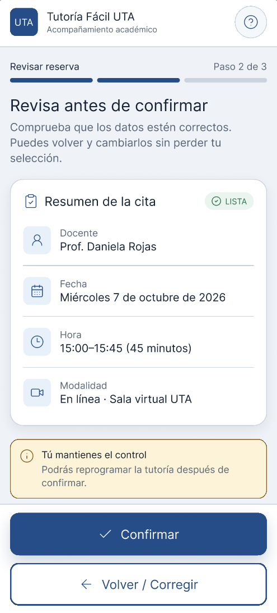
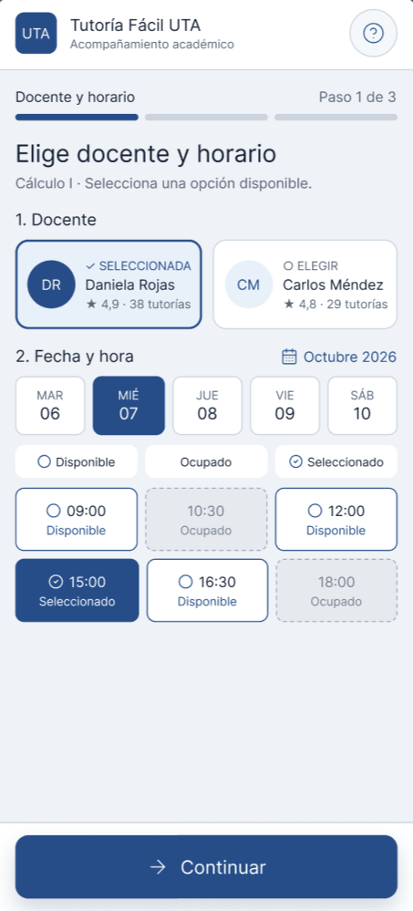
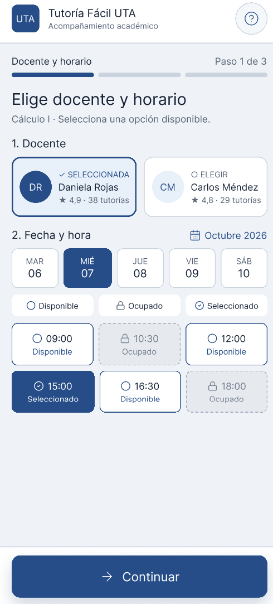

## Cambios realizados en el antes y después del prototipo

Prueba Cruzada realizada por Santiago Mora

Tiempo: 5 minutos

Resultado: Aprobado con parametros de mejora

Hallazgo: Mejoras de funcionalidades

* Adición del botón de retorno en la configuración de horarios

Antes

Después

* Implementación de metáforas, se añadió el candado en los horarios no disponibles para que el usuario pueda comprender que no están disponibles

Antes

Después

